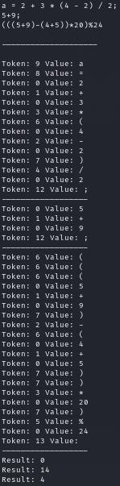

<!--Badger-->
# Logic Lingo

**Logic Lingo** is an interpreter that solves algebraic expressions.

[link](## TODO)
```diff
- This project is early in development, so there's still much to do as can be seen at the bottom of this `README.md` file in the `TODO` section.
+ Feel free to contribute to this project :)
- Math is 4 nerds =)
+ (Lol, jk)
```

## Overview

This custom language is designed to provide a simple but extensible platform for performing arithmetic operations, variable assignments, and function calls. It supports basic arithmetic operations such as addition, subtraction, multiplication, division, and modulous as well as variable definitions and function calls.
> The goal is to simulate how an interpreter(such as for Python) works at a low-level by reducing the complexities of a programming language.

> The end result is more of an algebraic calculator than a programming language, but the framework is prevalent for higher development.

## Syntax Tree

The language's syntax tree is hierarchical, with expressions composed of terms, terms composed of factors, and factors being numbers, identifiers (variables), or sub-expressions enclosed in parentheses. This structure allows for the evaluation of complex mathematical expressions.

```ebnf
program ::= statement { ";" statement } ;
statement ::= variable-definition | expression | function-call ;
variable-definition ::= identifier "=" expression ;
expression ::= term { ("+" | "-") term } ;
term ::= factor { ("*" | "/") factor } ;
factor ::= number | identifier | "(" expression ")" ;
function-call ::= function-name "(" expression ")" ;
function-name ::= "print" | "log" | "ln" | "sin" | "cos" | "tan" ; // Add other functions as needed
number ::= digit { digit } ;
identifier ::= letter { letter | digit | "_" } ;
letter ::= "a" | "b" | ... | "z" | "A" | "B" | ... | "Z" ;
digit ::= "0" | "1" | "2" | ... | "9" ;
```

## How It Works

The language consists of a lexer, a parser, and an evaluator. Here's how it works step by step:

1. **Lexical Analysis (Lexer)**: The input code is tokenized into a sequence of tokens. These tokens represent numbers, operators, variables, functions, and more.

	Token Types:
	|   #   |   Token Type  |
	|-------|---------------|
	|   0   |   Integer     |
	|   1   |   Plus        |
	|   2   |   Minus       |
	|   3   |   Multiply    |
	|   4   |   Divide      |
	|   5   |   Modulus     |
	|   6   |   Left Parenthesis  |
	|   7   |   Right Parenthesis |
	|   8   |   Equal       |
	|   9   |   Variable    |
	|   10  |   Function    |
	|   11  |   Function Argument |
	|   12  |   Command End |
	|   13  |   End         |

2. **Syntax Parsing (Parser)**: The lexer-generated tokens are parsed into an abstract syntax tree (AST) based on the defined grammar rules. The parser handles variable definitions, expressions, and function calls.

3. **Evaluation (Evaluator)**: The AST is evaluated to calculate expressions, assign variable values, and execute functions. The results of the evaluation are displayed.

## Example



`a = 2 + 3 * (4 - 2) / 2` is the 1st arithmetic expression to be solved.

1. Firstly, the input is sanitized by removing spaces & new lines/carriage returns.
	* Kind of a **Preprocessor**.
	* Output: `a=2+3*(4-2)/2`.
1. The inputted expression is then tokenized by the **lexer**:
	* Token: 9 Value: a
	* Token: 8 Value: =
	* Token: 0 Value: 2
	* Token: 1 Value: +
	* Token: 0 Value: 3
	* Token: 3 Value: *
	* Token: 6 Value: (
	* Token: 0 Value: 4
	* Token: 2 Value: -
	* Token: 0 Value: 2
	* Token: 7 Value: )
	* Token: 4 Value: /
	* Token: 0 Value: 2
	* Token: 12 Value: ;
1. The tokenized data is then parsed into an AST, so that variables' data can be stored and used for later and so that terms in the expression can be associated with eachother in order to be evaluated later(1+2+3 would have `1+2` associated and then associate the outputted `3` from evaluation to the `+3` after `1+2`, so that it can be evaluated into the `3+3`=`6` for a final program output).
1. The evaluator then solves the expression by looking for variables, operators, and functions and replacing them with what they do. Then the evaluator solves the expression by solving them within c++ such as `1+2`=`3` because the c++ code returns `3` as the number from adding the 2 #'s on either side of the operator, `+`.
	> The `Evaluator` function uses recursion to solve for expressions on the different sides before acting upon the values, so that it follows the `PEMDAS` when solving for cases such as `2+2/2`. `2+2/2`=>**3**, but if `Evaluator` didn't evaluate each side of the expression before continuing, the output would be `2+2/2`=>**2** because it would do *2+2*,*4/2*,**2** instead of *2/2*,*1+2*,**3**.
	```cpp
	int Evaluate(ASTNode* node) {
		if (node->type == TokenType::INT) {
			return std::stoi(node->value);
		}
		else if (node->type == TokenType::PLUS) {
			return Evaluate(node->left) + Evaluate(node->right);
		}
		//other operators & functions...
	}
	```

## TODO

- **Regex**: Use regular expressions to look for tokens, such as comments being an entire line and not really confined to specific space.
- **Preprocessor**: Preprocessor to look for any issues prior to interpreting and starting the lexical analysis. Ends w/ `;`
> Ending w/ `;` doesn't work rn because it looks for what command is after it and doesn't see anything, so it gets confused.
- **Step-by-Step Problem Solving**: Implement a step-by-step problem-solving feature.
- **Variable Substitution**: Substitute variable for it's value instead of saying that the identifier "=" is not found.
	* Variables should be defined/declared w/ `=`, but if `=` isn't present, variables should be parsed and substituted with their value to be evaluated(`a=2;a+2`=>**4**).
- **Algebraic Equation Solving**: Algebraic solving(do on both sides).
	* ex.: a+2=2+3 => a=3
	* allow for algebraic expression solving such as `a+2=2+3` where the output will be `a=3` since the 2's cancel out. this solving for both sides will apply for all operators.
- **Fractional Output**: Reduce results to improper fractions when applicable and provide approximate values as well(output as vector/array or something).
	* Might involve more framework adjusting since `Evaluate` only returns ints currently & i might wanna return matrices, vectors, & arrays/tuples.
	* Make `factor tree` function to simplify roots such as `sqrt(8)`=`2*sqrt(2)` because 8/2=4/2=2, so there's a pair of 2's and a leftover 2 in the sqrt.
- **Function Expansion**: Add functions like `sqrt`, `log`, `ln`, etc.
- **Global Variables**: Include global/predefined variables like `i` (imaginary unit) & `e` (Euler's number).

## Contribute

Feel free to contribute to the development and improvement of this custom language!